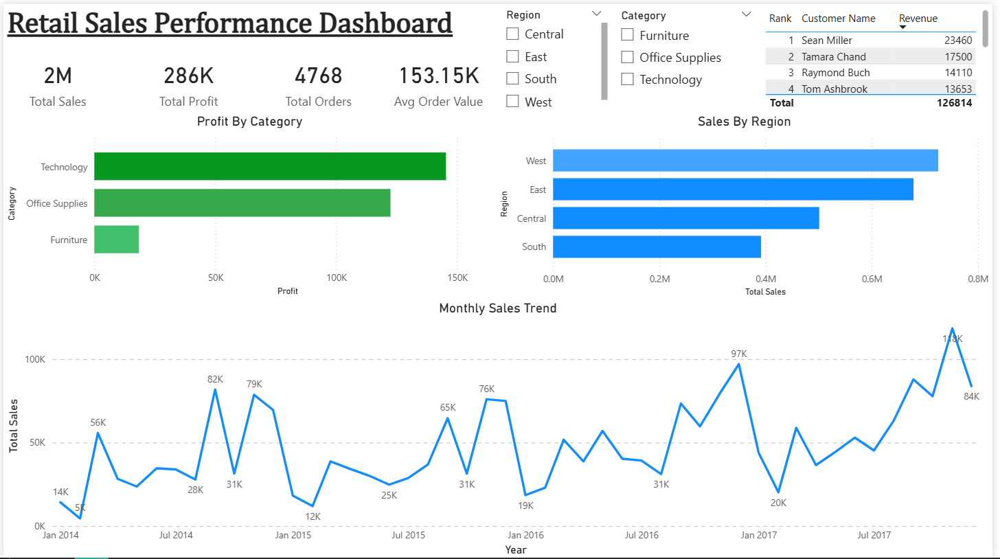
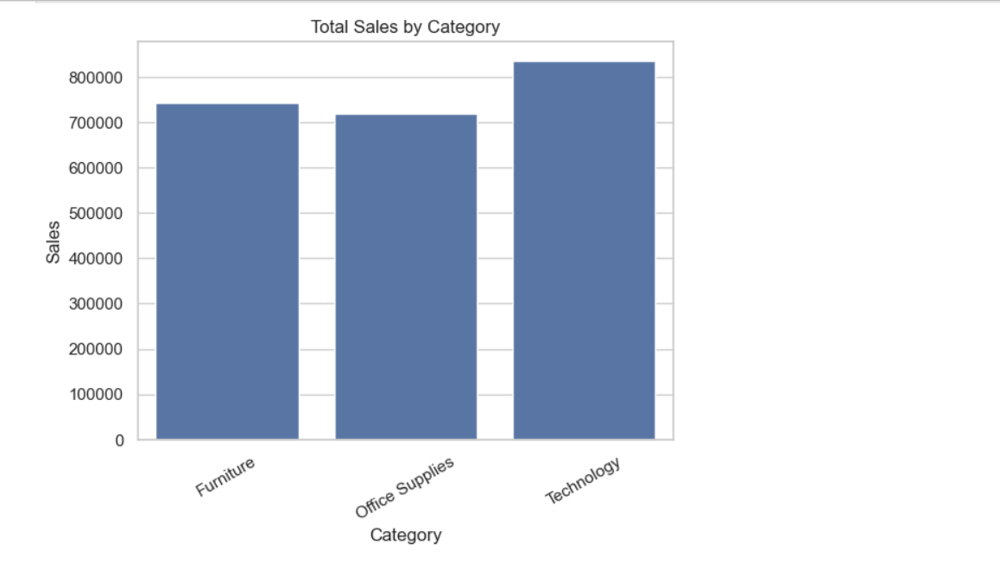
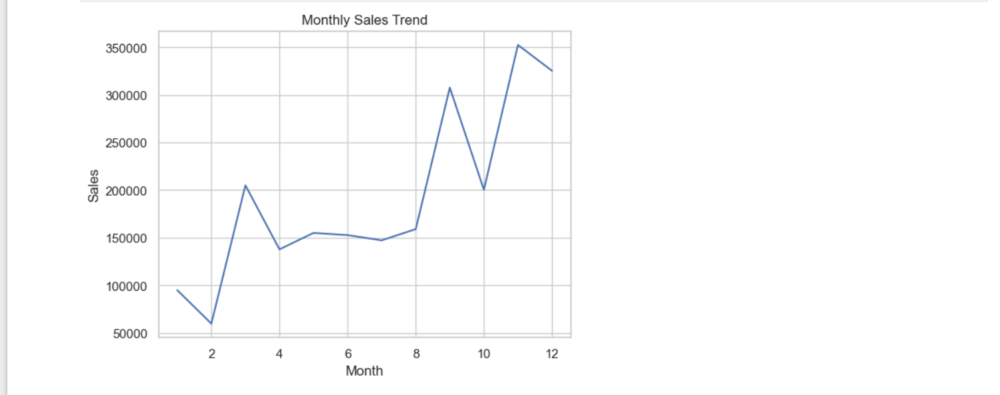
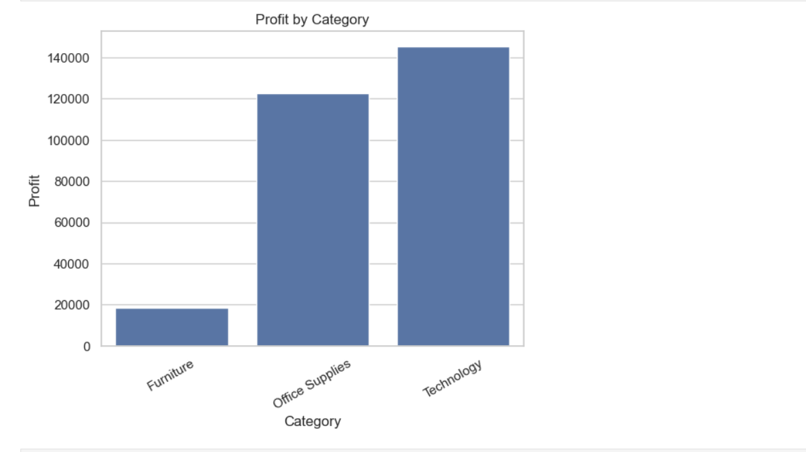

# 📊 Retail Sales Analysis (Pandas + Power BI Dashboard)

---

## 📌 Overview

This project analyzes a retail sales dataset to uncover insights related to customer behavior, product performance, and revenue trends. The workflow includes data cleaning, transformation, exploratory analysis using Python, and visualization through an interactive Power BI dashboard.

---

## 🎯 Objective

* Analyze retail sales data
* Identify key business insights
* Build a complete data analysis pipeline (Pandas → Power BI)

---

## 🛠 Tools & Technologies

* Python
* Pandas
* NumPy
* Matplotlib
* Seaborn
* Power BI

---

## 📊 Analysis Performed

### 🔹 Data Cleaning

* Removed duplicate records
* Checked and handled missing values
* Converted date columns to proper datetime format

---

### 🔹 Feature Engineering

* Extracted Year, Month, and Month Name from Order Date
* Created Profit Category (Profit / Loss)

---

### 🔹 Exploratory Data Analysis

* Category-wise sales and profit analysis
* Region-wise sales performance
* Customer-level revenue analysis
* Product-level profitability insights

---

### 🔹 Advanced Analysis

* Identified top customers contributing to revenue
* Analyzed low-performing (loss-making) products
* Studied correlation between Sales, Profit, Quantity, and Discount

---

## 📈 Power BI Dashboard

An interactive dashboard was built to visualize key insights:

* KPI Cards (Total Sales, Total Profit, Total Orders, Avg Order Value)
* Monthly Sales Trend (Time Series Analysis)
* Category-wise Profit Analysis
* Region-wise Sales Distribution
* Top Customers Table
* Interactive Slicers (Category & Region)

---

### 📸 Dashboard Preview



---

## 🔥 Key Insights

* Technology category generates the highest sales revenue
* A small group of customers contributes significantly to total sales (Pareto principle)
* Some products consistently generate losses and require attention
* Sales and profit are not always directly correlated
* Regional performance varies significantly across the business
* Sales trends indicate seasonality over time

---

## 💡 Business Impact

* Helps identify high-value customers for targeted marketing
* Supports decision-making on product and category focus
* Highlights loss-making products for cost optimization
* Enables data-driven business strategy

---

## 📸 Sample Visualizations

### 📊 Sales by Category



### 📈 Monthly Sales Trend



### 📊 Profit by Category



---

## 📁 Project Structure

```id="n8v3xk"
dataset/        → Raw dataset  
notebook/       → Jupyter Notebook (analysis)  
outputs/        → Visualizations & dashboard screenshots  
dashboard/      → Power BI dashboard (.pbix file)  
```

---

## 🚀 Key Skills Demonstrated

* Data Cleaning & Preprocessing
* Feature Engineering
* Exploratory Data Analysis (EDA)
* Business Insight Generation
* Data Visualization
* Dashboard Development using Power BI
* End-to-End Data Analytics Workflow

---

## 👨‍💻 Author

**Pankaj Juyal**
